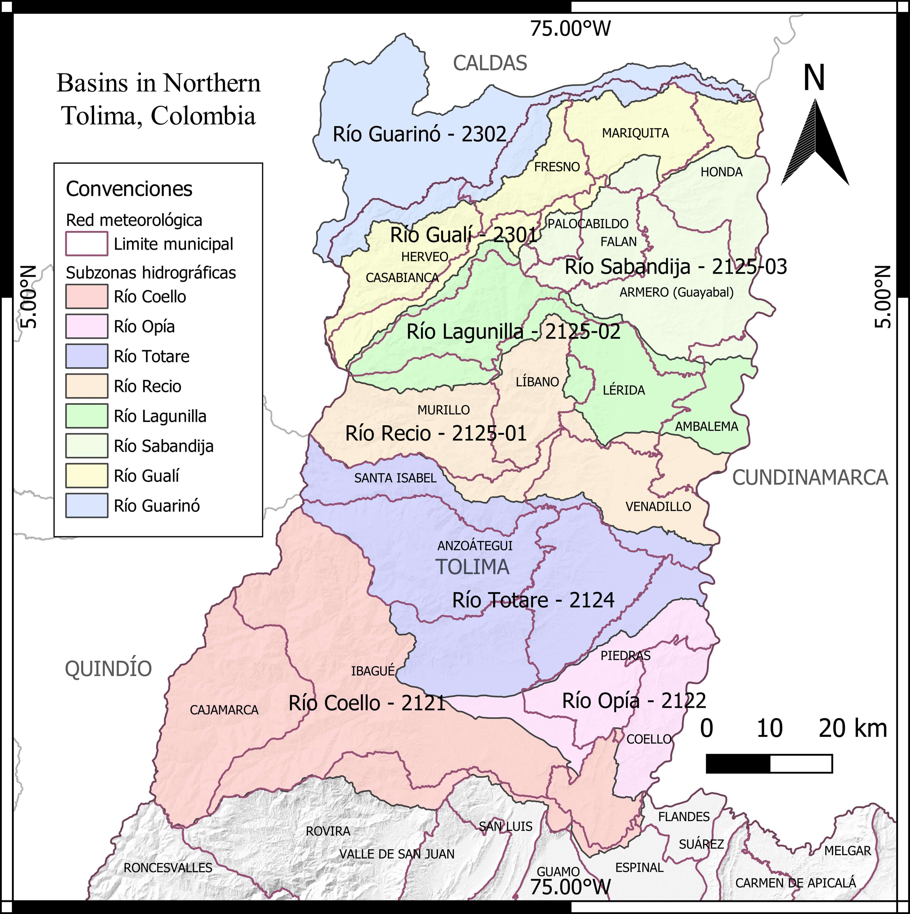

# Regional Water Assessment (RWA)

## Purpose of the Regional Water Assessment

Evaluate the state, dynamics and trends of the hydraulic systems as a result of the interaction of natural and anthropic processes for an adequate administration, use and sustainable management of water in the regions of Colombia. 

In this case the Regional Water Assessment is developed in the region of northern Tolima.

**Nortern Tolima RWA Project**

## Description of study area

The department of Tolima is located in the Andes of Colombia, between the Central and Eastern mountain ranges, with an area of ​​23,562 km²; It limits to the north with the department of Caldas, to the south with the department of Huila, to the east with the department of Cundinamarca, to the west with the departments of Valle del Cauca, Cauca, Quindío and Risaralda.

Within the framework of this project, the study area corresponds to the hydrographic basins located in the north of the department of Tolima, which are: Coello, Opia, Totare, Recio, Lagunilla, Sabandija, Gualí, and Guarinó. These basins are part of the hydrographic subzones defined by IDEAM, which are within the jurisdiction of the municipalities of: Anzoategui, Cajamarca, Coello, Espinal, Flandes, Guamo, Ibagué, Piedras, Roncesvalles, Rovira, San Luis, Valle de San Juan, Alvarado, Santa Isabel, Venadillo, Ambalema, Herveo, Lérida, Líbano, Murillo, Villahermosa, Armero Guayabal, Casabianca, Falan, Honda, Mariquita, Palocabildo and Fresno.

